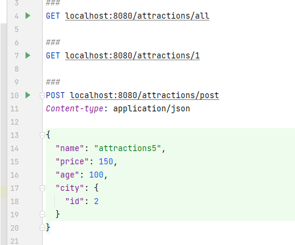

# Digital_Chief_Test
# Инструкция

1) Установить MySql

2) Запустить script.sql находящийся в корне проекта

3) В resources изменить  username: (ваш username)  и  password: (ваш password)

4) В файле requests.http, находящемся в корне проекта находятся requests для работы с нашим приложением

5) запуская команды поочередно можно наблюдать обмен json между клиент/сервер 

# Digital_Chief_Test
# Описание зависимостей

1) Зависимость lombok:

Lombok – это основанная на аннотациях библиотека Java, позволяющая сократить шаблонный код. 
В Lombok предлагаются различные аннотации, цель которых – заменить ненужный повторяющийся код. 

2) Зависимость 